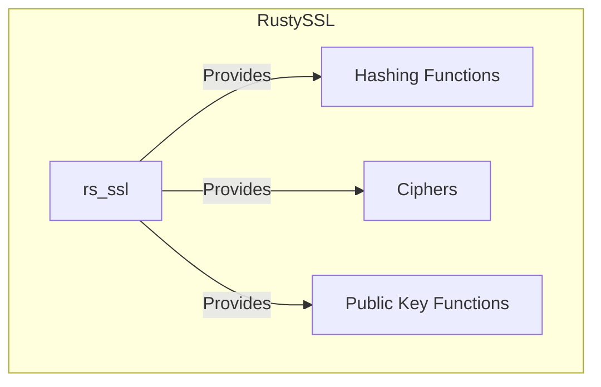
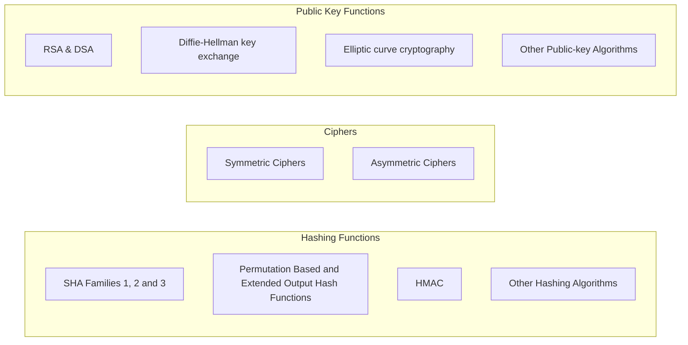

<!-- Allow this file to not have a first line heading -->
<!-- markdownlint-disable-file MD041 -->
<!-- Disable warning on emphasis after first heading -->
<!-- markdownlint-disable-file MD036 -->

<!-- inline html -->
<!-- markdownlint-disable-file MD033 -->

# RustySSL `rs_ssl`

**An OpenSSL inspired Rust based encryption library** 

## Vision

RustySSL seeks to establish the Rust language self-sufficency by offering an API that is fully compatible with [*Rust's core library*](https://doc.rust-lang.org/stable/core/index.html) , although not restricted to it. RustySSL aims to provide a reliable, user-friendly, standards-compliant, and platform-agnostic suite of  encryption tools.

## How To Use

See the [implementation documentation](https://docs.rs/rs_ssl/latest/rs_ssl/) for examples.

## Testing against NIST Test Vectors

All NIST-approved and published algorithms implemented in RustySSL undergo thorough testing against the respective NIST test vectors. Such rigorous testing guarantees the correctness and reliability of the implementations, offering a robust security foundation for any application built using RustySSL.

## RoadMap

1. The initial objective of RustySSL is to port all OpenSSL algorithms to the Rust ecosystem.
2. Following the port, RustySSL will continue to expand and incorporate additional cryptographic algorithms.
3. Although the current implementations are not the fastest, there is considerable room for improvement. There will probably a competitive performance boost once the [SIMD module](https://doc.rust-lang.org/core/simd/index.html) stabilizes;

After that the plan will be to implement some cryptocurrencies hashing algorithms like [Equihash](https://en.wikipedia.org/wiki/Equihash), [Ethereum's Keccak-256](https://ethereum.org/en/developers/docs/consensus-mechanisms/pow/mining-algorithms/ethash/) and others.

## Why This Project?

The benefits of RustySSL include:

- **Minimal Dependencies and Supply Chain Security**: By relying solely on Rust's core library, RustySSL minimizes the risk of dependency-related issues and provides an increased level of supply chain security. Trust is only required in the Rust core library team;
- **No `alloc` extern crate and Platform-Agnostic**: RustySSL avoids the `alloc` crate, enabling it to function without assuming the host has a heap allocator and enabling more embedded applications and kernel-level use saces. Additionally, leveraging Rust's libcore ensures cross-platform reliability, reducing complexity for the end-user;
- **Consolidated Design Pattern**: By adhering to the [`Hash`, `Hasher`, and `BuildHasher` design pattern from Rust's core library](https://doc.rust-lang.org/core/hash/index.html), users can interchangeably use any algorithm with a basic understanding of these traits;
- **Ecosystem Self-Sufficiency**: The project strengthens the Rust ecosystem's self-sufficiency by relying on its own implementations, reducing reliance on external variables through FFI calls.

## Philosophy

Inspired by the Unix philosophy, but adapting to the purpose of this project:

1. **Do One Thing Well**: Each implementation should focus on a single responsibility. If responsibilities diverge, a new crate should be created.
2. **Avoid Dependency Breakage**: Changing implementations should not break dependencies. If new traits are required, they should benefit all project implementations.
3. **Self-Support**: Implementations should be able to function solely with Rust's libcore and be backward compatible with it.
4. **Clarity Over Efficiency**: Clear, understandable code is prioritized over highly optimized but obscure solutions.

## Supported Algorithms

| Ciphers                       | Hashing Functions                                                                 | Public-key                                  |
| :---------------------------- | :-------------------------------------------------------------------------------- | :------------------------------------------ |
| AES - `coming soon`           | BLAKE2 - `coming soon`                                                           | DSA - `coming soon`                         |
| Blowfish - `coming soon`      | [Generic Keccak {200, 400, 800, 1600}](https://docs.rs/rs_keccak_nbits/latest/rs_keccak_nbits/) - [`rs_keccak_nbits`](https://crates.io/crates/rs_keccak_nbits) | Diffie-Hellman key exchange - `coming soon` |
| Camellia - `coming soon`      | GOST R 34.11-94 - `coming soon`                                                 | Ed25519 - `coming soon`                     |
| CAST-128 - `coming soon`      | [HMAC](https://docs.rs/rs_hmac/latest/rs_hmac/) - [`rs_hmac`](https://crates.io/crates/rs_hmac) | Ed448 - `coming soon`                       |
| Chacha20 - `coming soon`      | MD2 - `coming soon`                                                             | Elliptic curve - `coming soon`              |
| DES - `coming soon`           | MD4 - `coming soon`                                                             | GOST R 34.10-2001 - `coming soon`           |
| GOST 28147-89 - `coming soon` | MD5 - `coming soon`                                                             | RSA - `coming soon`                         |
| IDEA - `coming soon`          | MDC-2 - `coming soon`                                                           | SM2 - `coming soon`                         |
| Poly1305 - `coming soon`      | RIPEMD-160 - `coming soon`                                                      | X25519 - `coming soon`                      |
| RC2 - `coming soon`           | [SHA-1](https://docs.rs/rs_sha1/latest/rs_sha1/) - [`rs_sha1`](https://crates.io/crates/rs_sha1) | X448 - `coming soon`                        |
| RC4 - `coming soon`           | [SHA-224](https://docs.rs/rs_sha224/latest/rs_sha224/) - [`rs_sha224`](https://crates.io/crates/rs_sha224) |                                             |
| RC5 - `coming soon`           | [SHA-256](https://docs.rs/rs_sha256/latest/rs_sha256/) - [`rs_sha256`](https://crates.io/crates/rs_sha256) |                                             |
| SEED - `coming soon`          | [SHA-384](https://docs.rs/rs_sha384/latest/rs_sha384/) - [`rs_sha384`](https://crates.io/crates/rs_sha384) |                                             |
| SM4 - `coming soon`           | [SHA-512](https://docs.rs/rs_sha512/latest/rs_sha512/) - [`rs_sha512`](https://crates.io/crates/rs_sha512) |                                             |
| Triple DES - `coming soon`    | [SHA-512/224](https://docs.rs/rs_sha512_224/latest/rs_sha512_224/) - [`rs_sha512_224`](https://crates.io/crates/rs_sha512_224) |                                             |
|                               | [SHA-512/256](https://docs.rs/rs_sha512_256/latest/rs_sha512_256/) - [`rs_sha512_256`](https://crates.io/crates/rs_sha512_256) |                                             |
|                               | [SHA3-224](https://docs.rs/rs_sha3_224/latest/rs_sha3_224/) - [`rs_sha3_224`](https://crates.io/crates/rs_sha3_224) |                                             |
|                               | [SHA3-256](https://docs.rs/rs_sha3_256/latest/rs_sha3_256/) - [`rs_sha3_256`](https://crates.io/crates/rs_sha3_256) |                                             |
|                               | [SHA3-384](https://docs.rs/rs_sha3_384/latest/rs_sha3_384/) - [`rs_sha3_384`](https://crates.io/crates/rs_sha3_384) |                                             |
|                               | [SHA3-512](https://docs.rs/rs_sha3_512/latest/rs_sha3_512/) - [`rs_sha3_512`](https://crates.io/crates/rs_sha3_512) |                                             |
|                               | [SHAKE128](https://docs.rs/rs_shake128/latest/rs_shake128/) - [`rs_shake128`](https://crates.io/crates/rs_shake128) |                                             |
|                               | [SHAKE256](https://docs.rs/rs_shake256/latest/rs_shake256/) - [`rs_shake256`](https://crates.io/crates/rs_shake256) |                                             |
|                               | SM3 - `coming soon`                                                             |                                             |
|                               | Whirlpool - `coming soon`                                                       |                                             |

## Contributing

Contributions are very much welcomed from everyone.

If you have a suggestion of an algorithm that you want to see included in this project, please open an issue proposing it.

To contribute, please follow the [contribution guidelines](https://github.com/Azgrom/RustySSL/blob/master/CONTRIBUTING.md).

## Code of Conduct

The participation of each member of the Rust community is valued, and everyone is expected to have an enjoyable and fulfilling experience. For this reason, all participants, maintainers, and contributors must abide by the [Code of Conduct](./CODE_OF_CONDUCT.md).

## License

RustySSL is licensed under GPL-2.0-only. 

In plain English, this means you are free to use, modify, and distribute the software, provided that any modification must also be licensed under GPL-2.0-only. Or, if more convenient, for a modification that is an improvement and conforms to the [contribution guidelines](,/CONTRIBUTING.md) to bring it to the project.
